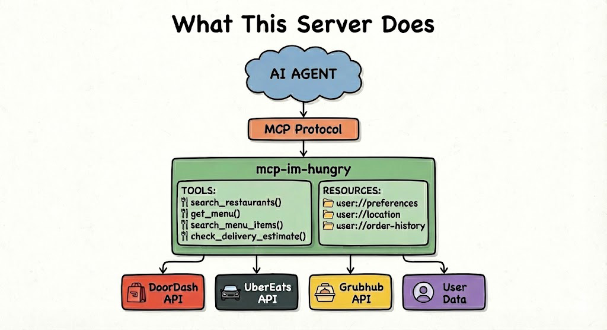

# mcp-im-hungry 🍔

An MCP server that connects AI agents to food delivery APIs and user data.

## Demo: How to Talk to Cursor


This GIF demonstrates exactly how to interact with Cursor using this MCP server. Simply open the Agents interface in Cursor and start chatting!

## Table of Contents

- [What is MCP?](#what-is-mcp)
- [What This Server Does](#what-this-server-does)
- [Quick Start](#quick-start)
- [Project Structure](#project-structure)
- [Tools](#tools)
- [Resources](#resources)
- [Connect to Cursor](#connect-to-cursor)
- [External Resources](#external-resources)

## What is MCP?

MCP (Model Context Protocol) is a protocol for AI agents to talk to data sources.  One standard interface that works with any data source.

Before MCP, connecting an AI to DoorDash + Uber Eats + your user database meant writing 3 different integrations. With MCP, you write one integration per service, and any AI that speaks MCP can use them all.

## What This Server Does



This MCP server **calls APIs directly** (or uses mock data) to aggregate data from multiple delivery services into a unified interface. The AI assistant uses this data to make decisions.

**Key Points:**
- **Direct API calls**: This server calls food delivery APIs directly (DoorDash, Uber Eats, Grubhub)
- **No agents**: This server does NOT use agents or A2A protocol
- **Mock data**: Currently uses mock data for demonstration purposes
- **For comparison**: See `mcp-a2a-im-hungry` for an example that uses A2A protocol to call agents instead 

## Quick Start

```bash
git clone https://github.com/tas1337/mcp-Im-hungry.git
cd mcp-Im-hungry
npm install
npm run build
```

Then configure Cursor (see [Connect to Cursor](#connect-to-cursor) section below).

To test the server with the MCP Inspector:
```bash
npm run inspect
```

## Project Structure

```
src/
├── index.ts          # Entry point
├── server.ts         # MCP server setup and handlers
├── tools.ts          # Tool definitions and handlers
├── resources.ts      # Resource definitions and readers
├── api-clients.ts    # API client functions (calls APIs directly, currently returns mock data)
├── mock-data.ts      # All mock data (restaurants, menus, user data)
└── types.ts          # TypeScript type definitions
```

**Architecture:** This server calls APIs directly via `api-clients.ts`. It does NOT use agents or A2A protocol.

## Tools

| Tool | Description |
|------|-------------|
| `search_restaurants` | Search across DoorDash, Uber Eats, Grubhub |
| `get_menu` | Get full menu for a specific restaurant |
| `search_menu_items` | Search for specific dishes across ALL restaurants |
| `check_delivery_estimate` | Get delivery times and fees |

## Resources

| Resource | Description |
|----------|-------------|
| `user://preferences` | Dietary restrictions, favorite cuisines, price range |
| `user://location` | Delivery address |
| `user://order-history` | Past orders for recommendations |

## Example Flow

1. User: "I want a cheeseburger"
2. AI reads `user://location` → San Francisco, CA
3. AI calls `search_restaurants({ query: "burger" })`
4. **Server directly calls APIs** (DoorDash, Uber Eats, Grubhub) - currently returns mock data
5. Returns: In-N-Out (4.8⭐), Shake Shack (4.6⭐), Five Guys (4.3⭐)...
6. AI calls `get_menu({ restaurantId: "ue-in-n-out" })`
7. **Server directly calls API** - returns menu data
8. Returns: Double-Double ($5.90), Cheeseburger ($3.65)...
9. AI recommends based on user preferences

**Note:** This server makes direct API calls. For an agent-based approach using A2A protocol, see `mcp-a2a-im-hungry`.

## Connect to Cursor

### Step 1: Clone and Build

```bash
git clone https://github.com/tas1337/mcp-Im-hungry.git
cd mcp-Im-hungry
npm install
npm run build
```

### Step 2: Create MCP Config (Project-specific - Recommended)

Create `.cursor/mcp.json` in the project root:

**Windows:**
```json
{
  "mcpServers": {
    "im-hungry": {
      "command": "node",
      "args": ["C:/Users/YourName/Documents/mcp-Im-hungry/dist/index.js"]
    }
  }
}
```

**Mac/Linux:**
```json
{
  "mcpServers": {
    "im-hungry": {
      "command": "node",
      "args": ["/path/to/mcp-Im-hungry/dist/index.js"]
    }
  }
}
```

**Note:** 
- Use forward slashes `/` in paths (works on Windows too)
- Replace the path with your actual project path (use absolute path)
- You can use `pwd` (Mac/Linux) or `cd` (Windows) to get your current directory path

### Alternative: Global Config

If you prefer a global config (works across all projects):

**Windows:** `%APPDATA%\Cursor\User\mcp.json`  
**Mac/Linux:** `~/.cursor/mcp.json` or `~/.config/Cursor/User/mcp.json`

Use the same JSON format as above.

### Step 3: Enable MCP in Cursor Settings

**Important:** MCP servers must be enabled in Cursor settings!

1. Open Cursor Settings (Ctrl+, or Cmd+,)
2. Search for "MCP" or "Tools"
3. Find the "MCP Servers" or "Model Context Protocol" section
4. Make sure your `im-hungry` server is listed and **enabled**
5. If it's disabled, toggle it on

### Step 4: Restart Cursor

Close and reopen Cursor completely for the changes to take effect.

### Step 5: Verify It's Working

1. Open a chat in Cursor
2. Ask: "I want a cheeseburger"
3. The AI should automatically use `search_restaurants` and `get_menu` tools
4. You should see restaurant results and menu items

**Troubleshooting:**
- If the AI doesn't use the tools, check Cursor Settings → MCP → make sure the server is **enabled**
- Check the Output panel (View → Output) for MCP errors
- Verify `dist/index.js` exists: `npm run build`
- Try restarting Cursor completely

## External Resources

- [MCP Specification](https://modelcontextprotocol.io)
- [MCP TypeScript SDK](https://github.com/modelcontextprotocol/typescript-sdk)
- [MCP Inspector](https://github.com/modelcontextprotocol/inspector)
